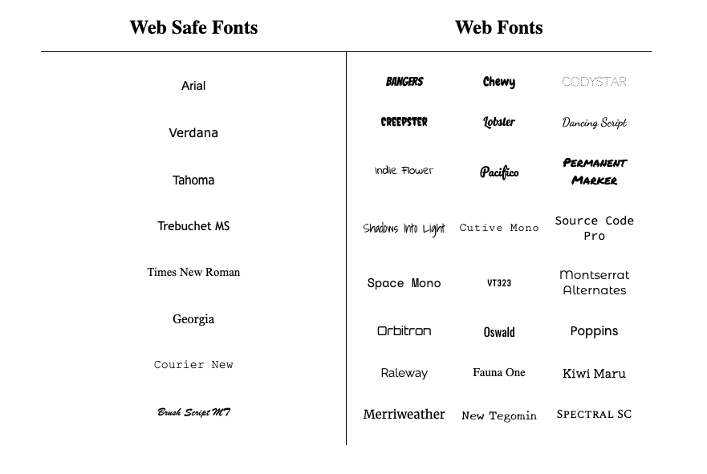
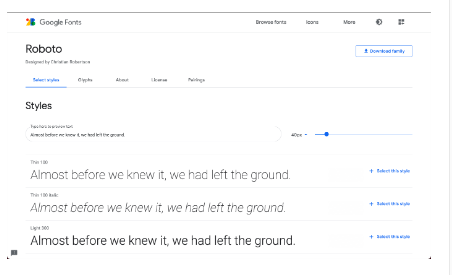

# Typography
In this lesson, we’ll focus on typography, the art of arranging text on a page. We’ll look at:

* How to style and transform fonts.
* How to lay text out on a page.
* How to add external fonts to your web pages.

Some of the most important information a user will see on a web page will be textual. Styling text to make page content accessible and engaging can significantly improve user experience. Let’s begin!


# Font Family
You may remember from the Visual Rules lesson that the font of an element can be changed using the font-family property.
```css
h1 {
  font-family: Arial;
}
```
In the example above, the font family for all``` <h1> ```heading elements have been set to Arial.

Let’s talk about some things to keep in mind when setting font-family values.

# Multi-Word Values
When specifying a typeface with multiple words, like Times New Roman, it is recommended to use quotation marks (' ') to group the words together, like so:
```css
h1 {
  font-family: 'Times New Roman';
}
```
# Web Safe Fonts
There is a selection of fonts that will appear the same across all browsers and operating systems. These fonts are referred to as web safe fonts. You can check out a complete list of web safe fonts here.

# Fallback Fonts and Font Stacks
Web safe fonts are good fallback fonts that can be used if your preferred font is not available.
```css
h1 {
  font-family: Caslon, Georgia, 'Times New Roman';
}
```
In the example above, Georgia and Times New Roman are fallback fonts to Caslon. When you specify a group of fonts, you have what is known as a font stack. A font stack usually contains a list of similar-looking fonts. Here, the browser will first try to use the Caslon font. If that’s not available, it will try to use a similar font, Georgia. And if Georgia is not available, it will try to use Times New Roman.

# Serif and Sans-Serif
You may be wondering what features make a font similar to another font. The fonts Caslon, Georgia, and Times New Roman are Serif fonts. Serif fonts have extra details on the ends of each letter, as opposed to Sans-Serif fonts, which do not have the extra details.


serif and sans-serif are also keyword values that can be added as a final fallback font if nothing else in the font stack is available.
```css
h1 {
  font-family: Caslon, Georgia, 'Times New Roman', serif;
}
```
In this final example, the font stack has 4 fonts. If the first 3 fonts aren’t available, the browser will use whatever serif font is available on the system.

# Instructions
1.
In ```style.css```, change the font family of the ```<h1>``` element to Georgia.


2.
In``` style.css```, change the font family of the ```.editorial``` elements to Trebuchet MS.


3.
In ```style.css```, use a font stack to give the ```.editorial ```elements fallback fonts of Times New Roman and serif.


# Font Weight
In CSS, the font-weight property controls how bold or thin text appears. It can be specified with keywords or numerical values.

# Keyword Values
The font-weight property can take any one of these keyword values:

* bold: Bold font weight.
* normal: Normal font weight. This is the default value.
* lighter: One font weight lighter than the element’s parent value.
* bolder: One font weight bolder than the element’s parent value

# Numerical Values
Numerical values can range from 1 (lightest) to 1000 (boldest), but it is common practice to use increments of 100. A font weight of 400 is equal to the keyword value normal, and a font weight of 700 is equal to bold.
```css
.left-section {
  font-weight: 700;
}
 
.right-section {
  font-weight: bold; 
}
```
In the example above, text in elements of both ```.left-section``` and ```.right-section ```classes will appear bold.

It’s important to note that not all fonts can be assigned a numeric font weight, and not all numeric font weights are available to all fonts. It’s a good practice to look up the font you are using to see which font-weight values are available.

# Instructions
1.
In``` style.css```, change the font weight of elements with the ```.banner p ```selector to lighter.


2.
In ```style.css```, change the font-weight of the``` .header ```class to 900.

# Font Style
You can also italicize text with the font-style property.
```css
h3 {
  font-style: italic;
}
```
The italic value causes text to appear in italics. The font-style property also has a normal value which is the default.

# Instructions
1.
The web page features three sections, “Garamond”, “Helvetica”, and “Space Mono”. Each of these sections includes a line with the name of the font creator, such as “Claude Garamond”. Let’s italicize the creator’s name on each of these cards.

In ```style.css```, in the font card section, set the font style of ```.font-card .creator ``` to italic.

# Text Transformation
Text can also be styled to appear in either all uppercase or lowercase with the text-transform property.
```css
h1 {
  text-transform: uppercase;
}
```
The code in the example above formats all``` <h1>``` elements to appear in uppercase, regardless of the case used for the heading within the HTML code. Alternatively, the lowercase value could be used to format text in all lowercase.

Since text can be directly typed in all uppercase or lowercase within an HTML file, what is the point of a CSS rule that allows you to format letter case?

Depending on the type of content a web page displays, it may make sense to always style a specific element in all uppercase or lowercase letters. For example, a website that reports breaking news may decide to format all ```<h1>``` heading elements such that they always appear in all uppercase, as in the example above. It would also avoid uppercase text in the HTML file, which could make code difficult to read.

# Instructions
1.
In ```style.css```, transform the text in the main heading (h1) to appear uppercase.

# Text Layout
You’ve learned how text can be defined by font family, weight, style, and transformations. Now you’ll learn about some ways text can be displayed or laid out within the element’s container.

# Letter Spacing
The letter-spacing property is used to set the horizontal spacing between the individual characters in an element. It’s not common to set the spacing between letters, but it can sometimes help the readability of certain fonts or styles. The letter-spacing property takes length values in units, such as 2px or 0.5em.
```css
p {
  letter-spacing: 2px;
}
```
In the example above, each character in the paragraph element will be separated by 2 pixels.

# Word Spacing
You can set the space between words with the word-spacing property. It’s also not common to increase the spacing between words, but it may help enhance the readability of bolded or enlarged text. The word-spacing property also takes length values in units, such as 3px or 0.2em.
```css
h1 {
  word-spacing: 0.3em;
}
```
In the example above, the word spacing is set to 0.3em. For word spacing, using em values are recommended because the spacing can be set based on the size of the font.

# Line Height


We can use the line-height property to set how tall we want each line containing our text to be. Line height values can be a unitless number, such as 1.2, or a length value, such as 12px, 5% or 2em.
```css
p {
  line-height: 1.4;
}
```
In the example above, the height between lines is set to 1.4. Generally, the unitless value is preferred since it is responsive based on the current font size. In other words, if the line-height is specified by a unitless number, changing the font size will automatically readjust the line height.

# Text Alignment
The text-align property, which you may already be familiar with from the CSS Visual Rules lesson, aligns text to its parent element.
```css
h1 {
  text-align: right;
}
```
In the example above, the``` <h1>``` element is aligned to the right side, instead of the default left.

# Instructions
1.
Let’s put these new properties to work! In style.css, set the letter spacing of the ```<h1> ```element to 0.3em.


2.
In ```style.css```, set the word spacing in the``` .banner p ```ruleset to 0.25em.


3.
In ```style.css```, set the line height in the ```.banner p``` ruleset to 1.4.


4.
In ```style.css```, set the text alignment of the``` <p> ```elements to ```justify```.

# Web Fonts
Previously, we learned about web safe fonts, a group of fonts supported across browsers and operating systems. However, the fonts you can use for your website are limitless—web fonts allow you to express your unique style through a multitude of different fonts found on the web.

Free font services, like Google Fonts and Adobe Fonts, host fonts that you can link to from your HTML document with a provided ```<link> ```element.

You can also use fonts from paid font distributors like fonts.com by downloading and hosting them with the rest of your site’s files. You can create a @font-face ruleset in your CSS stylesheet to link to the relative path of the font file.

Both techniques for including web fonts into your site allow you to go beyond the sometimes “traditional” appearance of web safe fonts.



# Web Fonts Using link
Online font services, like Google Fonts, make it easy to find and link to fonts from your site. You can browse and select fonts that match the style of your website.



When you select a font in Google Fonts, you’ll be shown all of the different styles available for that particular font. You can then select the styles you want to use on your site.


# Showing Selected Font Families
When you’re done selecting a font and its styles, you can review your selected font family, and a <link> element will be automatically generated for you to use on your site!
```html
<head>
  <!-- Add the link element for Google Fonts along with other metadata -->
  <link href="https://fonts.googleapis.com/css2?family=Roboto:wght@100&display=swap" rel="stylesheet">
</head>
```
The generated``` <link> ```element needs to be added to the ```<head> ```element in your HTML document for it to be ready to be used in your CSS.
```css
p {
  font-family: 'Roboto', sans-serif;
}
```
You can then create font-family declarations in your CSS, just like how you learned to do with other fonts!

# Instructions
1.
The font at the bottom of the page, under the Monospaced section, needs to be “Space Mono”. Let’s fix it by linking to the Space Mono Google Font!

Navigate to Google Fonts and select the “Space Mono” font. In the list of style variations, find “Regular 400” and click “+ Select this style”.

Copy the provided``` <link>``` element, and paste it into the ```<head>``` element inside index.html.


2.
In ```style.css```, inside the``` .space ```ruleset, create a declaration using the ```font-family``` property, with ```'Space Mono', monospace```; as the value.

# Web Fonts Using @font-face
Fonts can also be added using a @font-face ruleset in your CSS stylesheet instead of using a``` <link> ```element in your HTML document. As mentioned earlier, fonts can be downloaded just like any other file on the web. They come in a few different file formats, such as:

* OTF (OpenType Font)
* TTF (TrueType Font)
* WOFF (Web Open Font Format)
* WOFF2 (Web Open Font Format 2)

The different formats are a progression of standards for how fonts will work with different browsers, with WOFF2 being the most progressive. It’s a good idea to include TTF, WOFF, and WOFF2 formats with your @font-face rule to ensure compatibility on all browsers.

Let’s take a look at how to use @font-face using the same Roboto font as before:


Within the “Selected Families” section, you can use the “Download” button to download the font files to your computer. The files will be downloaded as a single format, in this case, TTF. You can use a tool such as Google Web Fonts Helper to generate additional file types for WOFF and WOFF2.

When you have the files you need, move them to a folder inside your website’s working directory, and you’re ready to use them in a @font-face ruleset!
```css
@font-face {
  font-family: 'MyParagraphFont';
  src: url('fonts/Roboto.woff2') format('woff2'),
       url('fonts/Roboto.woff') format('woff'),
       url('fonts/Roboto.ttf') format('truetype');
}
```
Let’s take a look at the example above, line by line:

The``` @font-face ```at-rule is used as the selector. It’s recommended to define the``` @font-face ```ruleset at the top of your CSS stylesheet.


Inside the declaration block, the font-family property is used to set a custom name for the downloaded font. The name can be anything you choose, but it must be surrounded by quotation marks. In the example, the font is named 'MyParagraphFont', as this font will be used for all paragraphs.
The src property contains three values, each specifying the relative path to the font file and its format. In this example, the font files are stored inside a folder named fonts within the working directory.
Note that the ordering for the different formats is important because our browser will start from the top of the list and search until it finds a font format that it supports. Read more on format prioritization on CSS-Tricks.
Once the ```@font-face``` at-rule is defined, you can use the font in your stylesheet!
```css
p {
  font-family: 'MyParagraphFont', sans-serif;
}
```

Like using any other fonts, you can use the font-family property to set the font on any HTML element. The downloaded font can be referenced with the name you provided as the font-family property’s value in the @font-face ruleset—in this case, 'MyParagraphFont'.

# Instructions
1.
Let’s change the font of the banner using local font files. If you open up the fonts/ directory using the file navigator in the code editor, you’ll notice that we have added local font files ```Glegoo-Regular.woff2```, ```Glegoo-Regular.woff```,``` Glegoo-Regular.ttf```.

At the top of ```style.css```, create a ```@font-face``` ruleset and give it the font-family property and ```'GlegooBanner'``` as its value.


2.
Within the ```@font-face``` rule, add a src property with the following paths and formats as values, in the following order:
```
url('../fonts/Glegoo-Regular.woff2') and a format of 'woff2'
url('../fonts/Glegoo-Regular.woff') and a format of 'woff'
url('../fonts/Glegoo-Regular.ttf') and a format of 'truetype'
```

3.
Inside the ```.banner p ```ruleset, add a declaration that sets the font family to ```'GlegooBanner'```, with a font size of 20px.

Press “Run” to see the changes in the browser.